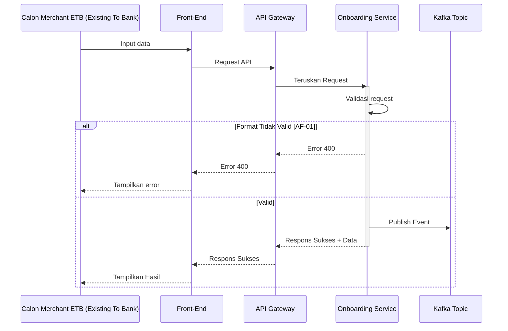

# Template API + Kafka Consumer + Kafka Publisher


Gunakan template ini untuk service yang menerima proses melalui HTTP REST atau Kafka Consumer, menjalankan business process yang sama, lalu mempublikasikan business event ke Kafka jika kondisi publish terpenuhi.

## General Information

| Item | Keterangan |
| --- | --- |
| **Service Name** | `<SERVICE_NAME>` |
| **API Path** | `<API_PATH>` |
| **Method** | `<HTTP_METHOD>` |
| **Protocol** | `HTTP REST + Kafka Consumer + Kafka Publisher` |
| **Consumer Topic** | `<CONSUMER_TOPIC>` |
| **Publisher Topic** | `<PUBLISHER_TOPIC>` |
| **Description** | `<Jelaskan fungsi service dalam 1 sampai 2 kalimat>` |
| **Category** | `<SERVICE_CATEGORY>` |
| **Kode Service** | `<SERVICE_CODE>` |

| **Tabel yang Digunakan** | `<TABLE_1>`, `<TABLE_2>` atau `N/A` |
| **Redis Key** | `<REDIS_KEY_PATTERN>` atau `N/A` |

### Version Control

| Version | Date | Author | Remarks |
| --- | --- | --- | --- |
| 1.0.0 | `<YYYY-MM-DD>` | System Analyst | Initial creation |

---

## Sequence Diagram



---

## Entry Point

Service menerima business request melalui salah satu entry point berikut.

| Entry Point | Source | Trigger | Output Langsung |
| --- | --- | --- | --- |
| REST API | `<CLIENT/SERVICE>` | HTTP request ke `<API_PATH>` | HTTP response |
| Kafka Consumer | `<PRODUCER_SERVICE>` | Event pada `<CONSUMER_TOPIC>` | Kafka acknowledgment setelah kriteria commit terpenuhi |

Kedua entry point dipetakan ke business payload yang sama sebelum menjalankan proses utama.

## HTTP REST Contract

### Request Header

| No | Key | Type | M/O/C | Description |
|----|-----|------|-------|-------------|
| 1 | **`Content-Type`** | String | M | Wajib: `application/json` |
| 2 | **`X-TIMESTAMP`** | String | M | Waktu request sesuai standar ISO8601. Format: `YYYY-MM-DDThh:mm:ssTZD` |
| 3 | **`traceId`** | String | M | Kode unik tracing request. |

### Request Body

| No | Key | Type | M/O/C | Description |
| ---: | --- | --- | :---: | --- |
| 1 | `<fieldName>` | String | M | `<Deskripsi field>` |
| 2 | `<objectName>` | Object | M | `<Deskripsi object>` |
| 2.a | `<objectName.fieldName>` | String | M | `<Deskripsi field>` |

### Contoh HTTP Request

```http
POST <API_PATH> HTTP/1.1
Host: <API_HOST>
Content-Type: application/json
X-TIMESTAMP: <TIMESTAMP>
CHANNEL-ID: <CHANNEL_ID>
traceId: <TRACE_ID>

{
  "<fieldName>": "<value>"
}
```

### Response Body

| No | Key | Type | M/O/C | Description |
| ---: | --- | --- | :---: | --- |
| 1 | `responseCode` | String | M | Kode respons standar service. |
| 2 | `responseMessage` | String | M | Pesan respons. |
| 3 | `traceId` | String | M | ID tracing request. |
| 4 | `timestamp` | String | M | Waktu respons. |
| 5 | `result` | Object | C | Data hasil proses jika tersedia. |
| 6 | `additionalInfo` | Object | C | Detail error jika proses gagal. |

### Response Code Mapping

| No | HTTP Status | Response Code | Description |
| ---: | --- | --- | --- |
| 1 | `200 OK` | `<SUCCESS_CODE>` | Proses berhasil. |
| 2 | `400 Bad Request` | `<BAD_REQUEST_CODE>` | Request tidak valid. |
| 3 | `401 Unauthorized` | `<UNAUTHORIZED_CODE>` | Autentikasi atau otorisasi gagal. |
| 4 | `404 Not Found` | `<NOT_FOUND_CODE>` | Data referensi tidak ditemukan. |
| 5 | `409 Conflict` | `<CONFLICT_CODE>` | Data konflik atau duplikat. |
| 6 | `500 Internal Server Error` | `<INTERNAL_ERROR_CODE>` | Proses internal gagal. |

### Contoh Response Sukses

```json
{
  "responseCode": "<SUCCESS_CODE>",
  "responseMessage": "Successful",
  "traceId": "<TRACE_ID>",
  "timestamp": "<TIMESTAMP>"
}
```

### Contoh Response Gagal

```json
{
  "responseCode": "<ERROR_CODE>",
  "responseMessage": "<ERROR_MESSAGE>",
  "traceId": "<TRACE_ID>",
  "timestamp": "<TIMESTAMP>",
  "additionalInfo": {
    "reason": "<ERROR_REASON>",
    "errorCode": "<INTERNAL_ERROR_CODE>"
  }
}
```

## Kafka Consumer Contract

Service menerima business event dari `<PRODUCER_SERVICE>` melalui topic `<CONSUMER_TOPIC>`.

### Consumer Configuration

| Item | Value | Description |
| --- | --- | --- |
| **Topic** | `<CONSUMER_TOPIC>` | Topic sumber event. |
| **Producer Service** | `<PRODUCER_SERVICE>` | Service yang mempublikasikan event. |
| **Consumer Group** | `<CONSUMER_GROUP>` | Consumer group service. |
| **Message Key** | `<CONSUMER_MESSAGE_KEY>` | Key untuk routing atau ordering. |
| **Partition Strategy** | `<BY_KEY / FIXED / DEFAULT>` | Strategi pemilihan partition. |
| **Partition** | `<PARTITION_NUMBER>` atau `N/A` | Isi jika menggunakan fixed partition. |
| **Content Type** | `application/json` | Format message value. |

### Consumer Header

| No | Key | Type | M/O/C | Description |
| ---: | --- | --- | :---: | --- |
| 1 | `trace-id` | String | M | Trace ID untuk korelasi proses. |
| 2 | `<HEADER_KEY>` | String | O | `<Deskripsi header tambahan>` |

### Consumer Message Body

| No | Key | Type | M/O/C | Description |
| ---: | --- | --- | :---: | --- |
| 1 | `timestamp` | String | M | Waktu event dibuat. |
| 2 | `trace_id` | String | M | Trace ID event. |
| 3 | `service.name` | String | M | Nama producer service. |
| 4 | `deployment.environment` | String | M | Environment producer. |
| 5 | `payload` | Object | M | Business payload. |
| 5.a | `payload.<fieldName>` | String | M | `<Deskripsi field>` |

### Contoh Consumer Message

```json
{
  "timestamp": "<TIMESTAMP>",
  "trace_id": "<TRACE_ID>",
  "service": {
    "name": "<PRODUCER_SERVICE>"
  },
  "deployment": {
    "environment": "<ENVIRONMENT>"
  },
  "payload": {
    "<fieldName>": "<value>"
  }
}
```

### Consumer Validation

| Validation | Rule |
| --- | --- |
| **JSON Format** | Payload harus berupa JSON valid. |
| **Mandatory Fields** | Field wajib harus tersedia dan tidak kosong. |
| **Field Format** | Validasi format setiap field sesuai kontrak event. |
| **Business Rule** | Validasi nilai dan hubungan antar-field sesuai aturan bisnis. |

Error non-retryable diproses sesuai kebijakan DLT atau acknowledgment service. Error retryable mengikuti kebijakan retry.

## Business Payload Mapping

Gunakan satu canonical business payload agar REST API dan Kafka Consumer menjalankan business process yang sama.

| Business Field | REST API Source | Kafka Consumer Source | Transformation | M/O/C |
| --- | --- | --- | --- | :---: |
| `traceId` | Header `traceId` | Header `trace-id` atau `trace_id` | Normalisasi ke trace ID internal | M |
| `<fieldName>` | `<request.field>` | `payload.<field>` | Direct mapping | M |
| `<fieldName>` | `<request.field>` | `payload.<field>` | `<TRANSFORMATION>` | C |

## Kafka Publisher Contract

Service mempublikasikan business event setelah `<PUBLISH_TRIGGER>` terpenuhi.

### Publisher Configuration

| Item | Value | Description |
| --- | --- | --- |
| **Topic** | `<PUBLISHER_TOPIC>` | Topic tujuan event. |
| **Event Name** | `<EVENT_NAME>` | Nama business event. |
| **Producer Service** | `<SERVICE_NAME>` | Service yang mempublikasikan event. |
| **Message Key** | `<PUBLISHER_MESSAGE_KEY>` | Key untuk routing atau ordering. |
| **Partition Strategy** | `<BY_KEY / FIXED / DEFAULT>` | Strategi pemilihan partition. |
| **Partition** | `<PARTITION_NUMBER>` atau `N/A` | Isi jika menggunakan fixed partition. |
| **Content Type** | `application/json` | Format message value. |
| **Publish Trigger** | `<PUBLISH_TRIGGER>` | Kondisi yang wajib terpenuhi sebelum publish. |

### Publisher Header

| No | Key | Type | M/O/C | Description |
| ---: | --- | --- | :---: | --- |
| 1 | `trace-id` | String | M | Gunakan trace ID dari entry point asal. |
| 2 | `<HEADER_KEY>` | String | O | `<Deskripsi header tambahan>` |

### Publisher Message Body

| No | Key | Type | M/O/C | Source | Description |
| ---: | --- | --- | :---: | --- | --- |
| 1 | `timestamp` | String | M | System | Waktu event dibuat. |
| 2 | `trace_id` | String | M | Entry Point | Trace ID transaksi. |
| 3 | `service.name` | String | M | Configuration | Nama producer service. |
| 4 | `deployment.environment` | String | M | Configuration | Environment aplikasi. |
| 5 | `payload` | Object | M | Business Process | Payload business event. |
| 5.a | `payload.<fieldName>` | String | M | `<Input/DB/System>` | `<Deskripsi field>` |

### Contoh Publisher Message

```json
{
  "timestamp": "<TIMESTAMP>",
  "trace_id": "<TRACE_ID>",
  "service": {
    "name": "<SERVICE_NAME>"
  },
  "deployment": {
    "environment": "<ENVIRONMENT>"
  },
  "payload": {
    "<fieldName>": "<value>"
  }
}
```

### Mapping Business Process ke Publisher

| Publisher Field | Source | Transformation | M/O/C | Description |
| --- | --- | --- | :---: | --- |
| `trace_id` | Internal trace ID | Direct mapping | M | Pertahankan trace ID dari entry point asal. |
| `payload.<field>` | `<business.field>` | Direct mapping | M | `<Deskripsi>` |
| `payload.<field>` | `<db.field>` | `<TRANSFORMATION>` | C | `<Deskripsi>` |

## Redis Operations

Gunakan bagian ini hanya jika service mengakses Redis.

Format key:

`[nama_aplikasi].[domain].[fitur].[fungsi].[jenis_identitas].{nilai_identitas}`

| Jenis Identitas | Redis Key Pattern | Data Type | TTL | Description |
| --- | --- | --- | --- | --- |
| **Distributed Lock** | `<REDIS_LOCK_KEY_PATTERN>` | `STRING` (`PX`/`NX`) | `<TTL>` | Mencegah proses paralel untuk business ID yang sama. |
| `<IDENTITY>` | `<REDIS_KEY_PATTERN>` | `<STRING/JSON/HASH>` | `<TTL>` | `<Fungsi key>` |

## Database Operations

| No | Operation | Table | Condition | Description |
| ---: | --- | --- | --- | --- |
| 1 | `<SELECT/INSERT/UPDATE>` | `<TABLE_NAME>` | `<CONDITION>` | `<Tujuan operasi>` |
| 2 | `<SELECT/INSERT/UPDATE>` | `<TRACKER_TABLE>` | `<CONDITION>` | `<Tujuan operasi>` |

## Dependency dan Komponen

| Komponen | Status | Fungsi |
| --- | :---: | --- |
| `lib-res-code` | Mandatory | Standarisasi response dan exception HTTP. |
| `<Kafka Client SDK>` | Mandatory | Kafka Consumer dan Publisher. |
| `AWS Secrets Manager SDK` | `<Mandatory/Optional>` | Mengambil secret aplikasi. |
| `<Database Driver>` | `<Mandatory/Optional>` | Mengakses database. |
| Redis | Optional | Distributed lock atau state idempotensi. |
| `<SDK/Library>` | Optional | `<Fungsi>` |

Jangan simpan password, token, access key, secret key, atau credential lain secara langsung di source code.

## Implementation Flow

### 1. Initialize Dependencies

1. Inisialisasi HTTP handler.
2. Inisialisasi Kafka Consumer dan Publisher.
3. Inisialisasi database, Redis, dan dependency lain yang digunakan.

### 2. Receive Input

#### REST API

1. Terima request pada `<API_PATH>`.
2. Ambil `traceId` dari request header.
3. Validasi header dan request body.
4. Map request body ke canonical business payload.

#### Kafka Consumer

1. Terima event dari `<CONSUMER_TOPIC>`.
2. Ambil `trace-id` untuk korelasi proses.
3. Validasi header dan message body.
4. Map `payload` ke canonical business payload.

### 3. Check Idempotency and Concurrency

1. Tentukan idempotency key dari `<BUSINESS_ID>`.
2. Periksa status proses sebelumnya pada `<IDEMPOTENCY_STORE>`.
3. Ambil distributed lock jika service menggunakannya.
4. Jangan ulangi perubahan data yang sudah berstatus `SUCCESS`.

### 4. Validate Business Rules

1. `<BUSINESS_VALIDATION_1>`
2. `<BUSINESS_VALIDATION_2>`
3. Hentikan proses jika validasi gagal.

### 5. Execute Business Process

1. Mulai database transaction jika proses membutuhkan transaksi atomik.
2. `<BUSINESS_STEP_1>`
3. `<BUSINESS_STEP_2>`
4. Simpan tracker atau status proses yang diperlukan.
5. Commit transaction jika seluruh operasi database berhasil.
6. Rollback transaction jika operasi database gagal.

### 6. Evaluate Publisher Trigger

Periksa kondisi publish berikut sebelum membuat event.

| Field / Condition | Expected Value |
| --- | --- |
| `<FIELD_1>` | `<VALUE_1>` |
| `<FIELD_2>` | `<VALUE_2>` |
| `<PROCESS_RESULT>` | `SUCCESS` |

Jika kondisi tidak terpenuhi, jangan publish event dan lanjutkan ke penyelesaian entry point.

### 7. Publish Business Event

1. Bentuk event sesuai Kafka Publisher Contract.
2. Gunakan trace ID yang sama dengan entry point asal.
3. Publish event ke `<PUBLISHER_TOPIC>`.
4. Simpan status publish jika service membutuhkannya untuk retry atau recovery.

### 8. Complete Entry Point

#### REST API

1. Kembalikan HTTP response sesuai hasil business process.
2. Gunakan `traceId` yang sama pada response.

#### Kafka Consumer

1. Commit offset setelah seluruh kriteria sukses untuk event terpenuhi.
2. Jalankan retry atau DLT jika proses gagal sesuai klasifikasi error.

### 9. Cleanup

Lepaskan distributed lock dan hapus temporary state yang tidak lagi diperlukan.

## Failure Handling

| Failure Point | REST API | Kafka Consumer | Publisher Handling |
| --- | --- | --- | --- |
| Input validation | Kembalikan `4xx` sesuai mapping | Non-retryable atau DLT sesuai kebijakan | Tidak publish |
| Business validation | Kembalikan response sesuai aturan bisnis | Non-retryable atau DLT sesuai kebijakan | Tidak publish |
| Database error | Rollback dan kembalikan `5xx` | Retry jika retryable | Tidak publish |
| Kafka publish error | `<RETURN ERROR / OUTBOX / OTHER>` | Retry atau recovery sesuai strategi | Tandai publish gagal |

## Retry dan Dead-Letter Topic

### Retryable Error

- Kafka broker timeout.
- Database timeout.
- Network timeout.
- Gangguan dependency sementara.

Contoh konfigurasi:

```text
maxAttempts       : <MAX_ATTEMPTS>
initialBackoff    : <INITIAL_BACKOFF>
backoffMultiplier : <BACKOFF_MULTIPLIER>
maxBackoff        : <MAX_BACKOFF>
```

### Non-Retryable Error

- Payload bukan JSON valid.
- Mandatory field tidak tersedia.
- Format field melanggar kontrak.
- `<PERMANENT_BUSINESS_ERROR>`

### Retry dan DLT Topic

```text
<CONSUMER_TOPIC>.retry
<CONSUMER_TOPIC>.dlt
```

Kirim event ke DLT jika batas retry terlewati atau error diklasifikasikan sebagai permanen sesuai kebijakan service.

## Kafka Acknowledgment

Commit offset Consumer hanya berlaku untuk input Kafka. Request REST tidak menggunakan mekanisme Kafka acknowledgment.

```text
Receive Consumer Event
  -> Validate Event
  -> Map Business Payload
  -> Execute Business Process
  -> Evaluate Publish Trigger
  -> Publish Event if Required
  -> Commit Consumer Offset
```

## Idempotency dan Concurrency

| Skenario | Expected Behavior |
| --- | --- |
| REST request dengan business ID yang sama dikirim ulang | `<IDEMPOTENT_RESPONSE_OR_RULE>` |
| Kafka event yang sama diterima ulang | Jangan ulangi perubahan data yang sudah `SUCCESS`. |
| REST request dan Kafka event untuk business ID yang sama masuk bersamaan | Distributed lock atau mekanisme concurrency service mencegah proses paralel. |
| Publish berhasil tetapi penyelesaian consumer gagal | Recovery tidak menghasilkan duplicate business effect pada consumer downstream. |

## Tracker

Gunakan tabel `<TRACKER_TABLE>` jika service membutuhkan audit tracker.

| Column | Contoh Value | Aturan |
| --- | --- | --- |
| `<business_id>` | `<BUSINESS_ID>` | Identifier proses utama. |
| `created_by` | `{"id":"<ID>","name":"<NAME>"}` | Identitas user atau service pemrakarsa. |
| `action_type` | `<ACTION_TYPE>` | Kode aktivitas. |
| `action_result` | `SUCCESS` / `FAILED` | Hasil aktivitas. |
| `action_notes` | `-` / `<ERROR_CODE>` | Detail singkat atau error code. |
| `show_to` | `<VISIBILITY>` | Visibilitas tracker. |

### Action Type Mapping

| Step | Action Type | Success Condition | Failure Result |
| ---: | --- | --- | --- |
| 1 | `<PROCESS_ACTION>` | Business process selesai | `FAILED` |
| 2 | `<PUBLISH_ACTION>` | Event berhasil dipublikasikan | `FAILED` |

## Logging Standards (Kafka Application Logs)

Semua log aplikasi dipublikasikan secara asinkron ke Kafka Topic `hibank.qris.application.logs` sesuai dengan standar REQ-NFR-008 (referensi: `system-design/docs/technical-docs/kafka-logging-standards.md`).

| Atribut | Nilai |
| --- | --- |
| Topic | `hibank.qris.application.logs` |
| Partition Key | OTel `traceId` |
| Format | JSON Envelope |
| Consumer | Data Prepper (`hibank-qris-data-prepper`) |

### Contoh Envelope Log Kafka

```json
{
  "timestamp": "2026-06-22T16:00:00.000+07:00",
  "trace_id": "ext-20260622-0001",
  "service": {
    "name": "four-eyes-management"
  },
  "deployment": {
    "environment": "production"
  },
  "payload": {
    "level": "INFO",
    "message": "Create approval request processed",
    "context": {
      "action": "CREATE_APPROVAL_REQUEST",
      "status": "SUCCESS"
    }
  }
}
```

### Data Sensitif yang Dilarang Masuk Log

- KTP atau NIK lengkap.
- NPWP lengkap.
- Password, token, access key, secret key, atau credential rahasia.
- Payload bisnis secara utuh jika memuat data sensitif.

## Checklist Implementasi

### REST API Flow

| No | Aktivitas | Status | Catatan |
| ---: | --- | :---: | --- |
| 1 | Request diterima pada `<API_PATH>` | | |
| 2 | Header dan body tervalidasi | | |
| 3 | Business process berhasil | | |
| 4 | Publisher trigger dievaluasi | | |
| 5 | Event dipublikasikan jika kondisi terpenuhi | | |
| 6 | HTTP response dikembalikan | | |

### Kafka Consumer Flow

| No | Aktivitas | Status | Catatan |
| ---: | --- | :---: | --- |
| 1 | Event diterima dari `<CONSUMER_TOPIC>` | | |
| 2 | Header dan payload tervalidasi | | |
| 3 | Business process berhasil | | |
| 4 | Publisher trigger dievaluasi | | |
| 5 | Event dipublikasikan jika kondisi terpenuhi | | |
| 6 | Consumer offset di-commit | | |

