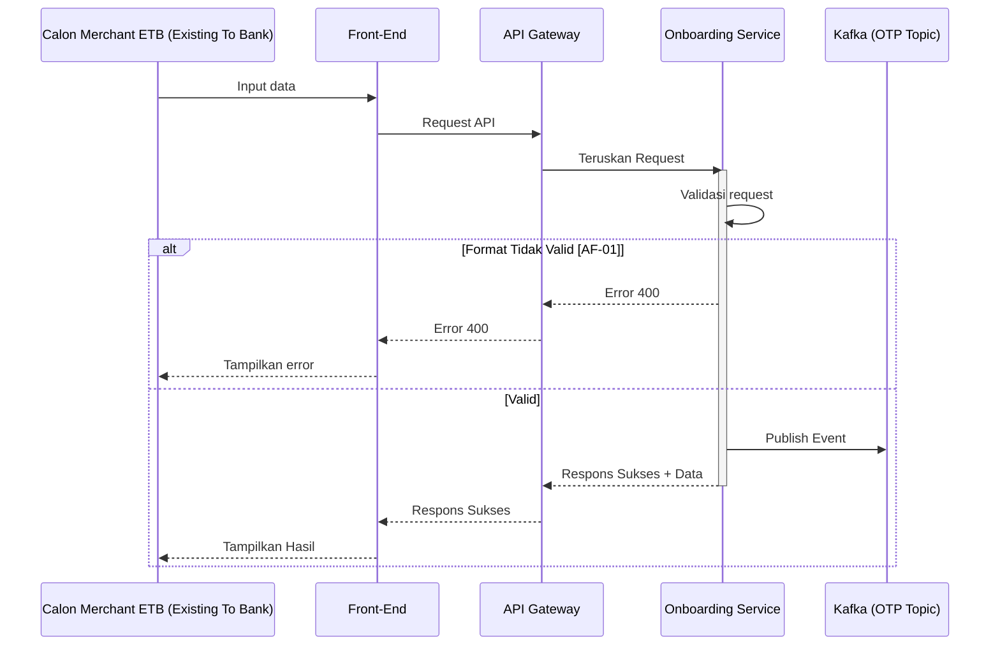

# Template API + Kafka Publisher


Gunakan template ini untuk endpoint HTTP REST yang memproses request secara sinkron dan mem-publish business event ke Kafka.

## General Information

| Item | Keterangan |
| --- | --- |
| **API Name** | `<API_NAME>` |
| **Path** | `<API_PATH>` |
| **Method** | `<HTTP_METHOD>` |
| **Protocol** | `HTTP REST + Kafka Publisher` |
| **Description** | `<Jelaskan fungsi endpoint dalam 1 sampai 2 kalimat>` |
| **Category** | `<SERVICE_CATEGORY>` |
| **Kode Service** | `<SERVICE_CODE>` |

| **Publisher Topic** | `<KAFKA_TOPIC>` |
| **Tabel yang Digunakan** | `<TABLE_1>`, `<TABLE_2>` |
| **Redis Key** | `<REDIS_KEY_PATTERN>` atau `N/A` |

### Version Control

| Version | Date | Author | Remarks |
| --- | --- | --- | --- |
| 1.0.0 | `<YYYY-MM-DD>` | System Analyst | Initial creation |

---

## Sequence Diagram



---

## HTTP Contract

### Request

#### Request Header

| No | Key | Type | M/O/C | Description |
|----|-----|------|-------|-------------|
| 1 | **`Content-Type`** | String | M | Wajib: `application/json` |
| 2 | **`X-TIMESTAMP`** | String | M | Waktu request sesuai standar ISO8601. Format: `YYYY-MM-DDThh:mm:ssTZD` |
| 3 | **`traceId`** | String | M | Kode unik tracing request. |

#### Request Body

| No | Key | Type | M/O/C | Description |
| --- | --- | --- | --- | --- |
| 1 | `<fieldName>` | String | M | `<Deskripsi field>` |
| 2 | `<objectName>` | Object | M | `<Deskripsi object>` |
| 2.a | `<objectName.fieldName>` | String | M | `<Deskripsi field>` |
| 3 | `<arrayName>` | Array of Object | O | `<Deskripsi array>` |
| 3.a | `<arrayName[].fieldName>` | String | M | `<Deskripsi field>` |

#### Contoh Request

```http
POST <API_PATH> HTTP/1.1
Host: <API_HOST>
Content-Type: application/json
X-TIMESTAMP: <TIMESTAMP>
CHANNEL-ID: WEB
traceId: <TRACE_ID>

{
  "<fieldName>": "<value>"
}
```

### Response

#### Response Body

| No | Key | Type | M/O/C | Description |
| --- | --- | --- | --- | --- |
| 1 | `responseCode` | String | M | Kode respons standar service. |
| 2 | `responseMessage` | String | M | Pesan respons. |
| 3 | `traceId` | String | M | ID tracing request. |
| 4 | `timestamp` | String | M | Waktu respons. |
| 5 | `result` | Object | C | Data hasil proses jika endpoint mengembalikan data. |
| 6 | `additionalInfo` | Object | C | Detail error jika proses gagal. |

#### Response Code Mapping

| No | HTTP Status | Response Code | Description |
| --- | --- | --- | --- |
| 1 | `200 OK` | `<SUCCESS_CODE>` | Proses berhasil. |
| 2 | `400 Bad Request` | `<BAD_REQUEST_CODE>` | Request tidak valid. |
| 3 | `401 Unauthorized` | `<UNAUTHORIZED_CODE>` | Autentikasi atau otorisasi gagal. |
| 4 | `409 Conflict` | `<CONFLICT_CODE>` | Data konflik atau duplikat. |
| 5 | `429 Too Many Requests` | `<RATE_LIMIT_CODE>` | Request melewati rate limit. |
| 6 | `500 Internal Server Error` | `<INTERNAL_ERROR_CODE>` | Proses internal gagal. |
| 7 | `504 Gateway Timeout` | `<TIMEOUT_CODE>` | Proses melewati batas waktu. |

#### Contoh Response Sukses

```json
{
  "responseCode": "<SUCCESS_CODE>",
  "responseMessage": "Successful",
  "traceId": "<TRACE_ID>",
  "timestamp": "<TIMESTAMP>"
}
```

#### Contoh Response Gagal

```json
{
  "responseCode": "<ERROR_CODE>",
  "responseMessage": "<ERROR_MESSAGE>",
  "traceId": "<TRACE_ID>",
  "timestamp": "<TIMESTAMP>",
  "additionalInfo": {
    "reason": "<ERROR_REASON>",
    "errorCode": "<INTERNAL_ERROR_CODE>"
  }
}
```

## Kafka Publisher

Bagian ini mendefinisikan business event yang dipublikasikan setelah kondisi publish terpenuhi.

### Kafka Configuration

| Item | Value | Description |
| --- | --- | --- |
| **Topic** | `<KAFKA_TOPIC>` | Topic tujuan event. |
| **Event Name** | `<EVENT_NAME>` | Nama event bisnis. |
| **Producer Service** | `<SERVICE_NAME>` | Service yang mem-publish event. |
| **Message Key** | `<MESSAGE_KEY>` | Key untuk menjaga routing event yang berkaitan. |
| **Partition Strategy** | `<BY_KEY / FIXED / DEFAULT>` | Strategi pemilihan partition. |
| **Partition** | `<PARTITION_NUMBER>` atau `N/A` | Isi jika menggunakan fixed partition. |
| **Content Type** | `application/json` | Format payload event. |
| **Publish Trigger** | `<PUBLISH_TRIGGER>` | Kondisi yang memicu publish. |

### Kafka Header

| No | Key | Type | M/O/C | Description |
| --- | --- | --- | --- | --- |
| 1 | `trace-id` | String | M | Trace ID yang sama dengan transaksi API. |
| 2 | `<header-key>` | String | O | `<Deskripsi header tambahan>` |

### Kafka Message Body

| No | Key | Type | M/O/C | Source | Description |
| --- | --- | --- | --- | --- | --- |
| 1 | `timestamp` | String | M | System | Waktu event dibuat. |
| 2 | `trace_id` | String | M | Request Header | Trace ID transaksi API. |
| 3 | `service.name` | String | M | Configuration | Nama producer service. |
| 4 | `deployment.environment` | String | M | Configuration | Environment aplikasi. |
| 5 | `payload` | Object | M | Business Process | Payload business event. |
| 5.a | `payload.<fieldName>` | String | M | `<API/DB/System>` | `<Deskripsi field>` |

### Contoh Kafka Message

```json
{
  "timestamp": "<TIMESTAMP>",
  "trace_id": "<TRACE_ID>",
  "service": {
    "name": "<SERVICE_NAME>"
  },
  "deployment": {
    "environment": "<ENVIRONMENT>"
  },
  "payload": {
    "<fieldName>": "<value>"
  }
}
```

### Mapping API ke Kafka

| API Source | Kafka Field | Transformation | M/O/C | Description |
| --- | --- | --- | --- | --- |
| `traceId` | `trace_id` | Direct mapping | M | Gunakan trace ID yang sama. |
| `<request.field>` | `payload.<field>` | Direct mapping | M | `<Deskripsi>` |
| `<db.field>` | `payload.<field>` | `<Transformation>` | C | `<Deskripsi>` |

## Redis Operations

Gunakan bagian ini hanya jika endpoint mengakses Redis.

Format key:

`[nama_aplikasi].[domain].[fitur].[fungsi].[jenis_identitas].{nilai_identitas}`

| Jenis Identitas | Redis Key Pattern | Data Type | TTL | Description |
| --- | --- | --- | --- | --- |
| `<IDENTITY>` | `<REDIS_KEY_PATTERN>` | `<STRING/JSON/HASH>` | `<TTL>` | `<Fungsi key>` |

## Database Operations

| No | Operation | Table | Condition | Description |
| --- | --- | --- | --- | --- |
| 1 | `<SELECT/INSERT/UPDATE>` | `<TABLE_NAME>` | `<CONDITION>` | `<Tujuan operasi>` |

## Implementation Flow

### 1. Initialize Dependencies

| Library / SDK | Status | Description |
| --- | --- | --- |
| `lib-res-code` | Mandatory | Mapping `responseCode` dan `responseMessage`. |
| `<Kafka Client SDK>` | Mandatory | Producer Kafka. |
| `AWS Secrets Manager SDK` | Mandatory | Mengambil secret aplikasi. |
| `<SDK lain>` | Optional | `<Fungsi>` |

### 2. Validate Request

1. Validasi format JSON.
2. Validasi mandatory field.
3. Validasi conditional field.
4. Validasi tipe dan format data.
5. Validasi enum jika ada.

### 3. Validate Business Rules

1. `<Validasi aturan bisnis pertama>`
2. `<Validasi aturan bisnis kedua>`
3. Hentikan proses dan kembalikan response code yang sesuai jika validasi gagal.

### 4. Process Database Transaction

1. Mulai database transaction.
2. `<INSERT/UPDATE data utama>`
3. `<INSERT/UPDATE data detail>`
4. Simpan tracker atau audit data jika diperlukan.
5. Commit transaction jika seluruh operasi berhasil.
6. Rollback transaction jika operasi database gagal.

### 5. Publish Event to Kafka

1. Bentuk payload Kafka sesuai kontrak pada bagian Kafka Publisher.
2. Gunakan `traceId` yang sama untuk korelasi API dan event.
3. Publish event ke `<KAFKA_TOPIC>` setelah `<PUBLISH_TRIGGER>` terpenuhi.
4. Jalankan retry sesuai konfigurasi jika publish gagal karena error retryable.
5. Jalankan fallback sesuai strategi service jika seluruh retry gagal.

### 6. Return HTTP Response

1. Kembalikan success response jika kriteria sukses endpoint terpenuhi.
2. Kembalikan error response jika proses sinkron gagal.

## Retry and Error Handling

### Retryable Kafka Error

Contoh:

- Kafka broker tidak tersedia.
- Network timeout.

| Configuration | Value |
| --- | --- |
| `maxAttempts` | `<MAX_ATTEMPTS>` |
| `initialBackoff` | `<INITIAL_BACKOFF_MS>` |
| `backoffMultiplier` | `<BACKOFF_MULTIPLIER>` |
| `maxBackoff` | `<MAX_BACKOFF_MS>` |

Jika seluruh retry gagal, jalankan fallback `<OUTBOX / DLQ / ERROR RESPONSE / OTHER>` sesuai desain service.

### Non-Retryable API Error

Contoh:

- Request tidak valid.
- Validasi bisnis gagal.
- Data konflik atau duplikat.

Kembalikan HTTP error tanpa retry.

### Kafka Failure Handling

| Kondisi | Database | Kafka | HTTP Response | Tindakan |
| --- | --- | --- | --- | --- |
| Database gagal | Rollback | Tidak publish | Error | Hentikan proses. |
| Database sukses, Kafka sukses | Commit | Published | Success | Selesaikan request. |
| Database sukses, Kafka gagal dan retry berhasil | Commit | Published | `<SUCCESS/CONFIGURED>` | Catat hasil retry. |
| Database sukses, Kafka gagal setelah retry | Commit | Failed | `<SUCCESS/ERROR>` | Jalankan `<FALLBACK_STRATEGY>`. |

## Tracker

Gunakan bagian ini jika endpoint mencatat tracker atau audit trail.

| Column | Contoh Value | Description |
| --- | --- | --- |
| `<transaction_id>` | `<ID>` | ID transaksi utama. |
| `created_by` | `{"id":"<ID>","name":"<NAME>"}` | Pelaku aksi. |
| `action_type` | `<ACTION_TYPE>` | Jenis aktivitas. |
| `action_result` | `SUCCESS` / `FAILED` | Hasil aktivitas. |
| `action_notes` | `<NOTES>` | Detail hasil atau kode error. |
| `show_to` | `<VISIBILITY>` | Visibilitas tracker. |

## Logging Standards (Kafka Application Logs)

Semua log aplikasi dipublikasikan secara asinkron ke Kafka Topic `hibank.qris.application.logs` sesuai dengan standar REQ-NFR-008 (referensi: `system-design/docs/technical-docs/kafka-logging-standards.md`).

| Atribut | Nilai |
| --- | --- |
| Topic | `hibank.qris.application.logs` |
| Partition Key | OTel `traceId` |
| Format | JSON Envelope |
| Consumer | Data Prepper (`hibank-qris-data-prepper`) |

### Contoh Envelope Log Kafka

```json
{
  "timestamp": "2026-06-22T16:00:00.000+07:00",
  "trace_id": "ext-20260622-0001",
  "service": {
    "name": "four-eyes-management"
  },
  "deployment": {
    "environment": "production"
  },
  "payload": {
    "level": "INFO",
    "message": "Create approval request processed",
    "context": {
      "action": "CREATE_APPROVAL_REQUEST",
      "status": "SUCCESS"
    }
  }
}
```


