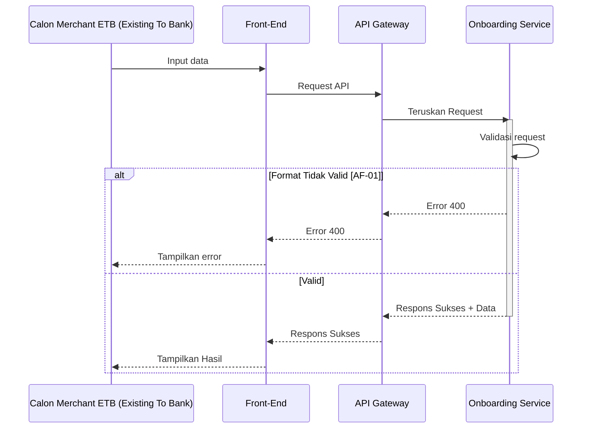

# Template REST API Murni

Gunakan template ini untuk endpoint HTTP REST yang menerima request, menjalankan validasi dan proses bisnis sinkron, mengakses database atau Redis bila diperlukan, lalu mengembalikan HTTP response tanpa Kafka Consumer, Kafka Publisher, atau outbound webhook.


## General Information

| Item | Keterangan |
| --- | --- |
| **API Name** | `<API_NAME>` |
| **Path** | `<API_PATH>` |
| **Method** | `<HTTP_METHOD>` |
| **Protocol** | `HTTP REST` |
| **Description** | `<Jelaskan fungsi endpoint dalam 1 sampai 2 kalimat>` |
| **Category** | `<SERVICE_CATEGORY>` |
| **Kode Service** | `<SERVICE_CODE>` |

| **Tabel yang Digunakan** | `<TABLE_1>`, `<TABLE_2>` atau `N/A` |
| **Stored Procedure** | `<SP_NAME>` atau `N/A` |
| **Redis Key** | `<REDIS_KEY_PATTERN>` atau `N/A` |

### Version Control

| Version | Date | Author | Remarks |
| --- | --- | --- | --- |
| 1.0.0 | `<YYYY-MM-DD>` | System Analyst | Initial creation |

---

## Sequence Diagram



---

## HTTP REST Contract

### Request Header

| No | Key | Type | M/O/C | Description |
|----|-----|------|-------|-------------|
| 1 | **`Content-Type`** | String | M | Wajib: `application/json` |
| 2 | **`X-TIMESTAMP`** | String | M | Waktu request sesuai standar ISO8601. Format: `YYYY-MM-DDThh:mm:ssTZD` |
| 3 | **`traceId`** | String | M | Kode unik tracing request. |

### Request Body

| No | Key | Type | M/O/C | Description |
| ---: | --- | --- | :---: | --- |
| 1 | `<fieldName>` | String | M | `<Deskripsi field>` |
| 2 | `<objectName>` | Object | M | `<Deskripsi object>` |
| 2.a | `<objectName.fieldName>` | String | M | `<Deskripsi field>` |
| 3 | `<arrayName>` | Array of Object | O | `<Deskripsi array>` |
| 3.a | `<arrayName[].fieldName>` | String | M | `<Deskripsi field>` |

### Contoh Request

```http
POST <API_PATH> HTTP/1.1
Host: <API_HOST>
Content-Type: application/json
X-TIMESTAMP: <TIMESTAMP>
CHANNEL-ID: <CHANNEL_ID>
traceId: <TRACE_ID>

{
  "<fieldName>": "<value>"
}
```

### Response Body

| No | Key | Type | M/O/C | Description |
| ---: | --- | --- | :---: | --- |
| 1 | `responseCode` | String | M | Kode respons standar service/SNAP BI jika berlaku. |
| 2 | `responseMessage` | String | M | Pesan respons. |
| 3 | `traceId` | String | M | Trace ID yang sama dengan request. |
| 4 | `timestamp` | String | M | Waktu respons. |
| 5 | `result` | Object | C | Data hasil proses bila endpoint mengembalikan data. |
| 6 | `additionalInfo` | Object | C | Detail error yang aman ditampilkan ke caller. |

### Response Code Mapping

| No | HTTP Status | Response Code | Description |
| ---: | --- | --- | --- |
| 1 | `200 OK` / `201 Created` | `<SUCCESS_CODE>` | Proses berhasil. |
| 2 | `400 Bad Request` | `<BAD_REQUEST_CODE>` | Format atau parameter request tidak valid. |
| 3 | `401 Unauthorized` | `<UNAUTHORIZED_CODE>` | Autentikasi gagal. |
| 4 | `403 Forbidden` | `<FORBIDDEN_CODE>` | Caller tidak memiliki hak akses. |
| 5 | `404 Not Found` | `<NOT_FOUND_CODE>` | Data referensi tidak ditemukan. |
| 6 | `409 Conflict` | `<CONFLICT_CODE>` | Duplikasi atau konflik state. |
| 7 | `422 Unprocessable Entity` | `<BUSINESS_ERROR_CODE>` | Request valid secara format tetapi gagal business rule, jika standar service memakai status ini. |
| 8 | `429 Too Many Requests` | `<RATE_LIMIT_CODE>` | Rate limit terlampaui jika diterapkan. |
| 9 | `500 Internal Server Error` | `<INTERNAL_ERROR_CODE>` | Kegagalan internal service. |
| 10 | `504 Gateway Timeout` | `<TIMEOUT_CODE>` | Dependency sinkron melewati timeout jika ada. |

### Contoh Response Sukses

```json
{
  "responseCode": "<SUCCESS_CODE>",
  "responseMessage": "Successful",
  "traceId": "<TRACE_ID>",
  "timestamp": "<TIMESTAMP>",
  "result": {}
}
```

### Contoh Response Gagal

```json
{
  "responseCode": "<ERROR_CODE>",
  "responseMessage": "<ERROR_MESSAGE>",
  "traceId": "<TRACE_ID>",
  "timestamp": "<TIMESTAMP>",
  "additionalInfo": {
    "reason": "<SAFE_ERROR_REASON>",
    "errorCode": "<INTERNAL_ERROR_CODE>"
  }
}
```

## Redis Operations

Gunakan bagian ini hanya jika endpoint mengakses Redis.

Format key:

`[nama_aplikasi].[domain].[fitur].[fungsi].[jenis_identitas].{nilai_identitas}`

| Jenis Operasi | Redis Key Pattern | Data Type | TTL | Description |
| --- | --- | --- | --- | --- |
| `<CACHE/LOCK/STATE>` | `<REDIS_KEY_PATTERN>` | `<STRING/JSON/HASH>` | `<TTL>` | `<Fungsi key>` |

## Database Operations

Dokumentasikan tujuan operasi, bukan SQL mentah, kecuali user memang meminta query.

| No | Operation | Table / Procedure | Condition / Business Key | Description |
| ---: | --- | --- | --- | --- |
| 1 | `<SELECT/INSERT/UPDATE/DELETE/CALL>` | `<TABLE_OR_SP>` | `<CONDITION>` | `<Tujuan operasi>` |

## Dependency dan Komponen

| Komponen | Status | Fungsi |
| --- | :---: | --- |
| `lib-res-code` | `<Mandatory/Optional>` | Mapping response code dan exception jika menjadi standar aplikasi. |
| `AWS Secrets Manager SDK` | `<Mandatory/Optional>` | Mengambil secret aplikasi tanpa hardcode. |
| PostgreSQL / `<Database>` | `<Mandatory/Optional>` | Menyimpan atau membaca data. |
| Redis | `<Mandatory/Optional>` | Cache, state idempotency, atau distributed lock. |
| `<HTTP Client SDK>` | `<Mandatory/Optional>` | Memanggil dependency sinkron jika endpoint memiliki downstream API. |
| `<SDK lain>` | Optional | `<Fungsi>` |

Jangan simpan password, token, access key, secret key, atau credential lain langsung di source code.

## Implementation Flow

### 1. Initialize Dependencies

1. Inisialisasi response/error library sesuai standar service.
2. Ambil konfigurasi dan secret yang dibutuhkan.
3. Inisialisasi database, Redis, dan dependency lain yang memang digunakan.

### 2. Receive and Normalize Request

1. Terima HTTP request pada `<HTTP_METHOD> <API_PATH>`.
2. Ambil `traceId` dan metadata request yang diwajibkan.
3. Normalisasi field tanpa mengubah makna bisnis.

### 3. Authenticate and Authorize

1. Verifikasi credential/token bila endpoint protected.
2. Verifikasi role/scope/permission bila proses membutuhkan otorisasi.
3. Kembalikan response `401` atau `403` sesuai penyebab kegagalan.

### 4. Validate Request

1. Validasi format JSON.
2. Validasi mandatory dan conditional field.
3. Validasi tipe, panjang, pola, enum, range, dan format field yang relevan.
4. Tolak field atau nilai yang melanggar kontrak.

### 5. Validate Business Rules

1. Ambil data referensi yang dibutuhkan.
2. Verifikasi state dan aturan bisnis sebelum mutation.
3. Hentikan proses dengan response code domain yang tepat bila rule gagal.

### 6. Check Idempotency and Concurrency

1. Tentukan business key atau idempotency key jika endpoint bersifat mutating dan berisiko menerima request ulang.
2. Kembalikan hasil yang konsisten atau tolak duplikasi sesuai kontrak.
3. Gunakan distributed lock hanya jika request paralel pada business key yang sama dapat menimbulkan race condition.

### 7. Execute Business Transaction

1. Mulai database transaction jika ada lebih dari satu mutation yang harus atomik.
2. Jalankan `<BUSINESS_STEP_1>`.
3. Jalankan `<BUSINESS_STEP_2>`.
4. Simpan tracker/audit yang wajib berada dalam transaksi yang sama.
5. Commit setelah seluruh mutation atomik berhasil.
6. Rollback jika operasi dalam transaction gagal.

### 8. Build and Return Response

1. Mapping hasil proses ke response contract.
2. Jangan expose raw database error, stack trace, secret, atau data sensitif.
3. Pertahankan `traceId` yang sama.
4. Kembalikan HTTP status dan response code yang konsisten.

## Transaction, Idempotency, dan Concurrency

| Concern | Rule |
| --- | --- |
| **Transaction Boundary** | Tentukan mutation mana yang wajib commit atau rollback sebagai satu unit. |
| **Idempotency** | Terapkan pada mutating endpoint bila retry caller berisiko membuat data ganda. |
| **Duplicate Request** | Definisikan apakah mengembalikan hasil sebelumnya, `409`, atau aturan domain lain. |
| **Distributed Lock** | Gunakan hanya bila concurrency pada business key yang sama dapat mengubah hasil. |
| **Lock Release** | Release lock pada jalur sukses dan gagal. |

## Error Handling

| Error Type | Contoh | Handling |
| --- | --- | --- |
| Validation | Missing mandatory field, invalid enum | Jangan retry internal. Kembalikan 4xx sesuai mapping. |
| Authentication | Token invalid/expired | Kembalikan `401`. |
| Authorization | Role/scope tidak sesuai | Kembalikan `403`. |
| Business Rule | State tidak memenuhi syarat | Kembalikan response domain yang disepakati. |
| Conflict | Duplicate/race condition | Kembalikan `409` atau aturan domain yang disepakati. |
| Database transient | Timeout/koneksi sementara | Retry hanya jika operasi aman dan kebijakan service mengizinkan. |
| Internal Error | Unexpected exception | Rollback transaksi aktif, log error terkontrol, kembalikan `500`. |
| Downstream Timeout | Synchronous dependency timeout | Terapkan timeout dan mapping error yang disepakati. |

## Tracker

Gunakan bagian ini hanya jika service membutuhkan audit tracker.

| Column | Contoh Value | Aturan |
| --- | --- | --- |
| `<business_id>` | `<BUSINESS_ID>` | Identifier transaksi utama. |
| `created_by` | `{"id":"<id>","name":"<name>"}` | Identitas caller atau service. |
| `action_type` | `<ACTION_TYPE>` | Kode aktivitas. |
| `action_result` | `SUCCESS` / `FAILED` | Hasil aktivitas. |
| `action_notes` | `-` / `<ERROR_CODE>` | Ringkasan hasil atau error code. |
| `show_to` | `<VISIBILITY>` | Visibilitas audit jika field digunakan. |

## Logging Standards (Kafka Application Logs)

Semua log aplikasi dipublikasikan secara asinkron ke Kafka Topic `hibank.qris.application.logs` sesuai dengan standar REQ-NFR-008 (referensi: `system-design/docs/technical-docs/kafka-logging-standards.md`).

| Atribut | Nilai |
| --- | --- |
| Topic | `hibank.qris.application.logs` |
| Partition Key | OTel `traceId` |
| Format | JSON Envelope |
| Consumer | Data Prepper (`hibank-qris-data-prepper`) |

### Contoh Envelope Log Kafka

```json
{
  "timestamp": "2026-06-22T16:00:00.000+07:00",
  "trace_id": "ext-20260622-0001",
  "service": {
    "name": "four-eyes-management"
  },
  "deployment": {
    "environment": "production"
  },
  "payload": {
    "level": "INFO",
    "message": "Create approval request processed",
    "context": {
      "action": "CREATE_APPROVAL_REQUEST",
      "status": "SUCCESS"
    }
  }
}
```

## Checklist Implementasi

| No | Check | Status |
| ---: | --- | :---: |
| 1 | Method dan path konsisten di seluruh dokumen | |
| 2 | Header, body, mandatory/optional/conditional field konsisten dengan contoh | |
| 3 | HTTP status dan response code konsisten | |
| 4 | AuthN/AuthZ didefinisikan bila diperlukan | |
| 5 | Business validation terjadi sebelum mutation | |
| 6 | Transaction boundary, commit, dan rollback jelas | |
| 7 | Idempotency/concurrency ditetapkan untuk mutating endpoint bila relevan | |
| 8 | Tracker dan logging tidak mengekspos data sensitif | |
| 9 | Failure pada dependency memiliki mapping response yang jelas | |
| 10 | Tidak ada Kafka Consumer, Kafka Publisher, atau webhook jika arsitektur memang API murni | |

